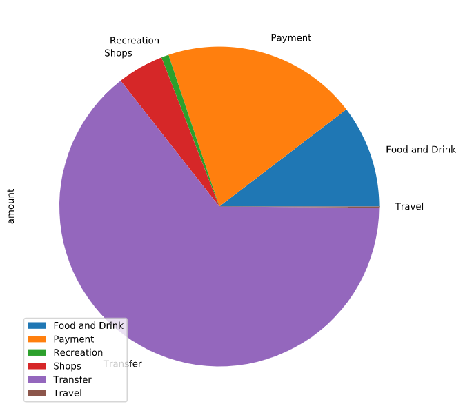
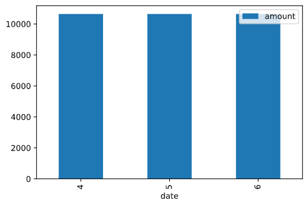
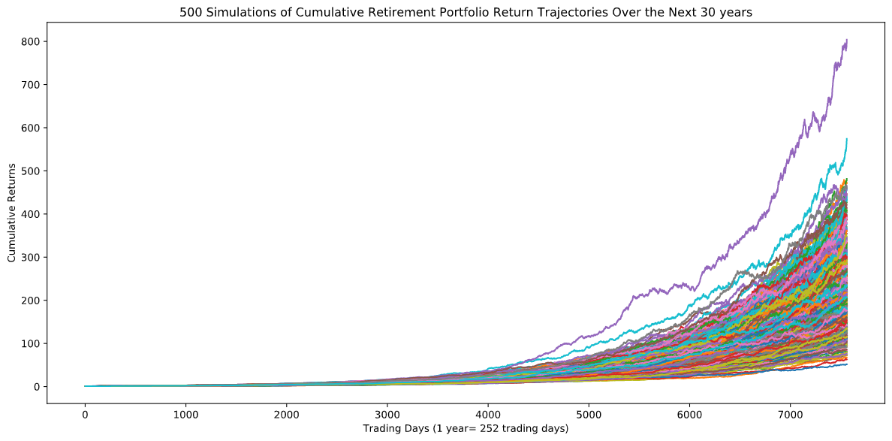
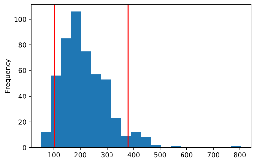
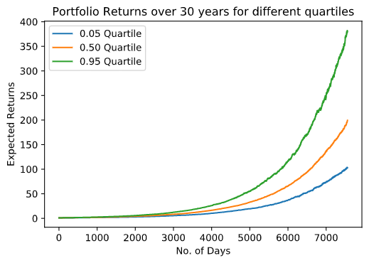
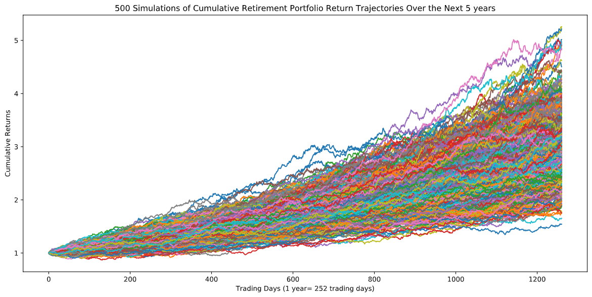
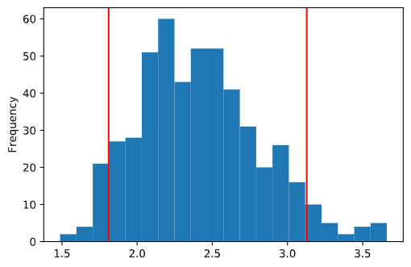
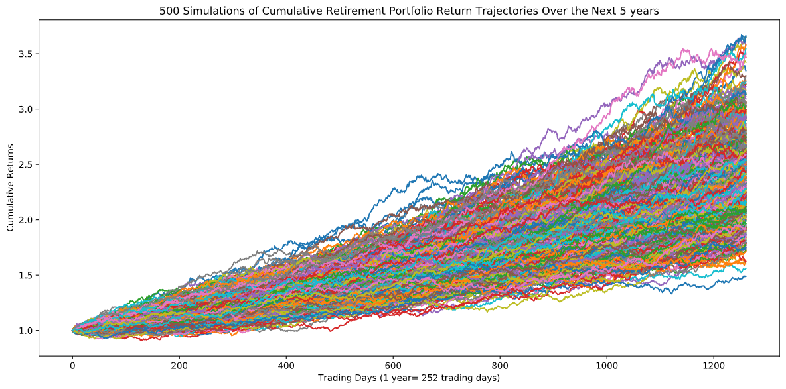

# APIs-Project

# Financial Report
In this report, I analyzed data pulled from personal bank accounts through Plaid API and historical stock prices pulled from Alpaca trade API. Through this data I have prepared this report for the Consumer Division of Harold's company. This analysis revolves around budgetary analysis and looking at various scenarios for retirement planning.

Language Used: Python, with Pandas used for Data Cleaning.    

APIs used: PLAID, ALPACA

Files: Jupyter Notebooks account_summary.ipynb and portfolio_planner.ipynb


## Income Summary

1. Generated a Plaid access token to access the Developer Sandbox.

2. Used the Access token to fetch account transactions from the sandbox. I fetched the last 90 days of transactions from the sandbox using the following institution:

    ```python
    INSTITUTION_ID = "ins_109508"
    ```

Based on income data pulled from Plaid API, the following data was analysed.
* Last year's gross income = $7285
* Current monthly income = $500
* Projected annual income for the next year = $6085


## Budget Analysis
The following expense heads were analyzed.
| Category      | Amount |
| ----------- | ----------- |
| Food and Drink | 3317.19
Payment      |   6310.50
Recreation   |     235.50
Shops        |    1500.00
Transfer    |    20537.34
Travel       |     35.19       

This data can be viewed visually through a pie chart also.



In this period, the person spent $10645.24 each in the previous three months. This is shown in the graph below.


# Retirement Planning
In this section, I analysed the performance of a portfolio which consists of stocks and bonds through a simulation based on Monte Carlo model using the historical price data of last one year.

* I took historical closing prices of SPY (SPDR S&P 500 ETF) and AGG (iShares Core U.S. Aggregate Bond ETF) for the last one year through Alapaca Trade API.
* This was used to calculate the average daily returns and volatility using standard deviation
* I created a portfolio consisting of 60% stocks (SPY) and 40% bonds (AGG) to test the returns 
* Thereafter, I ran a Monte Carlo simulations for 500 iterations over the next 30 years based on previous day's closing price (Assuming the standard deviation and volatility to follow a normal probabilistic distributional behavior)

## Analysis of Performance
The plot for the 500 Monte Carlo simulations over the next 30 years in given below.



At the end of 30 years, I found that the ending cumulative daily return is in the range 51.57 to 804.01. 

Though with the application of a 90% confidence interval, we can narrow down that range to 102.82 and 379.34. The maximum number of simulations showed an avergae return that is approximately close to 200.



For an initial investment of $20,000, an investor can get the following returns at 10th, 50th and 90th quantile.


| Quantile      | Cumulative Return | Amount Realised     |
| :---        |    :----:   |         :---: |
| 10          |   119.027485      |  $2380549.70    |
|   50          |   199.083857      |  $3981677.14    |
|   90          |   320.561549      |  $6411230.97     |

The equities have done reasonably well in the last year and hence, the reuturns on the portfolio are exceptional. So, even if there is a 4% withdrawal rate at the retirement, it would not affect the expected retirement income of $6085.

### Optional Challenge
If we increase the initial investment by 50%, the below chart shows the performance of the investment through its life over 5th, 50th and 95th quartile.




The challenge is to retire in 5 years instead of 30 and deisgn a portfolio that can help achieve that goal.
* Tweaking the security distribution (80% stocks and 20% bonds) while keeping the initial investment of $20,000 the same.



    * Through this approach, the investor can expect $43,705 at 10th quartile (return = 2.18), $58,115 at 50th quartile (return = 2.90) and $77394 at the 90th quartile (return = 3.87). 
    * With 4% withdrawal rate, the investor can expect a return of $1748.
    * With a 50% increase in initial investment and 4% withdrawal rate, the investor can expect a return of $2622

* Increasing the initial investment by 100% and keeping the portfolio risk as previously defined of 60% stocks and 40% bonds.


    * With a 90% confidence interval, the investor can get a return between 1.81 and 3.12.
    * Through this approach, the investor can expect $38,323 at 10th quartile (return = 1.91), $47,776 at 50th quartile (return = 2.39) and $59,531 at the 90th quartile (return = 2.98). 
    * With 4% withdrawal rate, the investor can expect a return of $1533.
    * With a 50% increase in initial investment and 4% withdrawal rate, the investor can expect a return of $2299

In both the scenarios, the model is not able to generate a retirement portfolio confidently. This would require more analysis to generate a confident return model.
